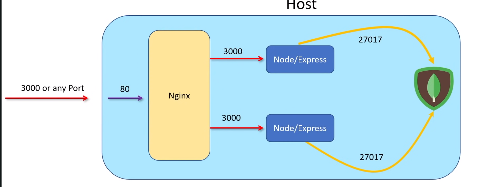

# YTNotes Backend

To Build & Run Dev: `docker-compose -f docker-compose.yaml -f docker-compose.dev.yaml up --build -d`

### Architecture

Credit: https://www.youtube.com/watch?v=9zUHg7xjIqQ&t=4142s&ab_channel=freeCodeCamp.org