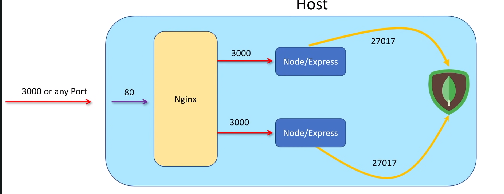

# YTNotes Backend

To Build & Run Dev: `docker-compose -f docker-compose.yaml -f docker-compose.dev.yaml up --build -d`

Right now, this backend is not deployed anywhere because I can't find a free cloud VM to use that doesn't need me to put in my credit card. Additionally, the free tier for other services are too restrictive in what I can do. As such, feel free to clone this repo and run the above command (make sure to install Docker on your local machine). At the end of the day, this is just a personal project for me to learn!

### Architecture

Credit: https://www.youtube.com/watch?v=9zUHg7xjIqQ&t=4142s&ab_channel=freeCodeCamp.org
